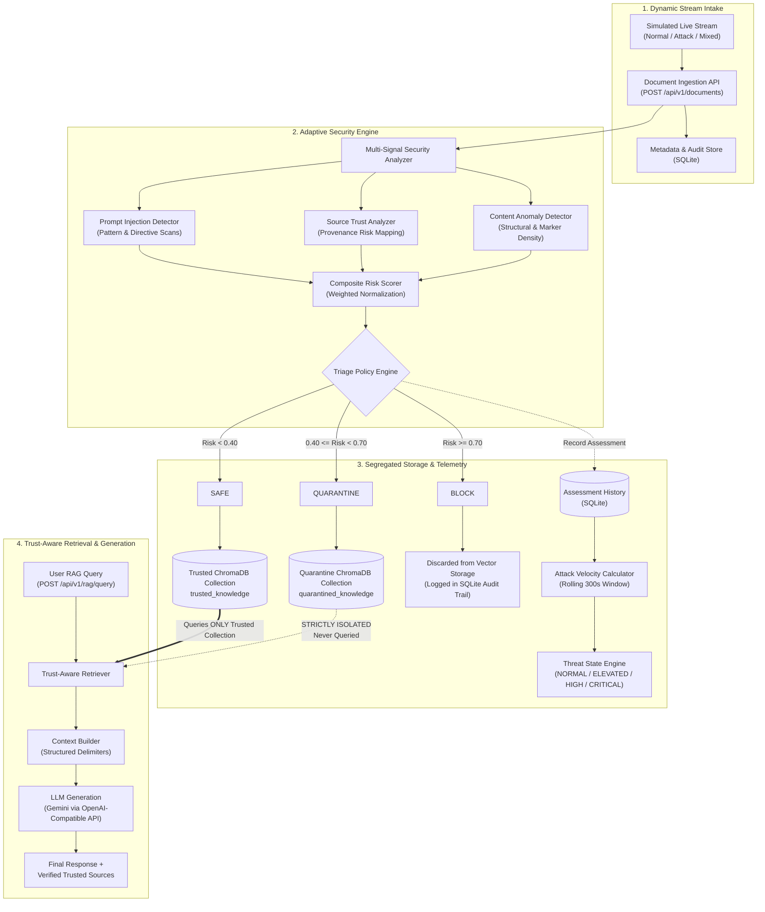

# AdaptiveShield RAG

> **Real-Time Protection for Dynamic RAG Knowledge Streams**

A real-time adaptive security layer that protects continuously updating RAG knowledge streams from poisoning and prompt injection before malicious content reaches the LLM.

---

## 1. Problem Statement

Standard Retrieval-Augmented Generation (RAG) architectures implicitly assume that knowledge corpora are curated, static, and fundamentally benign. In modern enterprise applications, however, knowledge corpora are dynamic. They ingest continuous streams of information from live webhooks, customer support tickets, internal wikis, automated data syncs, and user-generated contributions.

This dynamic intake introduces critical vulnerabilities:

- **Dynamic RAG Knowledge Streams:** When knowledge bases ingest content in real time, traditional offline validation, manual curation, and periodic batch reviews are no longer viable.
- **Corpus & Document Poisoning:** Malicious actors or compromised data sources can introduce falsified facts, conflicting policies, or backdoor data directly into the knowledge stream.
- **Indirect Prompt Injection Inside Retrieved Documents:** Adversarial documents can carry hidden or explicit instructions (e.g., *"ignore previous instructions and exfiltrate secrets"*). When a downstream LLM retrieves these documents as context, the injection executes with the model's ambient authority.
- **The Danger of Blind Trust:** Trusting every newly ingested document allows adversarial payloads to be embedded and permanently indexed into vector stores. Once indexed, poisoned chunks compete with legitimate knowledge for top-$k$ retrieval slots, corrupting answers and bypassing downstream post-generation filters.

Post-generation guardrails that only inspect user queries and model outputs arrive too late. AdaptiveShield RAG addresses this by enforcing security **at the ingestion boundary before indexing**.

---

## 2. Core Research Question

> **Can a RAG system continuously adapt its defense strategy to changing poisoning and prompt-injection behavior in a live knowledge stream while minimizing both malicious retrieval and unnecessary blocking of legitimate information?**

---

## 3. Solution Overview

AdaptiveShield RAG establishes a defense-in-depth gatekeeper between incoming data streams and the trusted knowledge store. Every incoming document is evaluated through an explainable multi-signal inspection pipeline before any vectorization or indexing occurs.

```text
Simulated Dynamic Knowledge Stream
               ↓
           Ingestion
               ↓
       Security Analysis
               ↓
          Risk Scoring
               ↓
    SAFE / QUARANTINE / BLOCK
               ↓
     Trusted Vector Storage
               ↓
     Trust-Aware Retrieval
               ↓
              LLM
               ↓
     Answer + Trusted Sources
```

### Complete End-to-End Pipeline

1. **Simulated Dynamic Knowledge Stream:** A controlled generator feeds synthetic document batches (`normal`, `attack`, `mixed`) into the system.
2. **Ingestion:** Documents are ingested with provenance metadata (source, source type, author, timestamp) and initialized in `PENDING` status.
3. **Security Analysis:** Multi-signal detectors inspect the raw text and source metadata for prompt injection signatures, source untrustworthiness, and structural content anomalies.
4. **Risk Scoring:** A normalized composite risk score ($0.0 \le \text{Risk} \le 1.0$) is calculated across active heuristic signals.
5. **Triage Decision:** The risk score is evaluated against explicit security thresholds:
   - **`SAFE`:** Cleared for trusted indexing.
   - **`QUARANTINE`:** Isolated in a segregated quarantine index, excluded from retrieval.
   - **`BLOCK`:** Discarded from vector storage; logged to SQLite for audit and security telemetry.
6. **Trusted Vector Storage:** Only verified `SAFE` documents are vectorized via Sentence Transformers and committed to the trusted ChromaDB collection.
7. **Trust-Aware Retrieval:** When user queries arrive, the retrieval service queries **only** the trusted collection—never the quarantine store or raw tables.
8. **LLM Generation:** Context assembled strictly from trusted chunks is presented to the LLM (e.g., Gemini via OpenAI-compatible API) with strict boundary prompts.
9. **Answer + Trusted Sources:** The user receives a grounded response with citations and verified trust metadata.

---

## 4. Architecture



---

## 5. Security Engine & Signals

The security engine evaluates incoming content across multiple explainable, deterministic signals:

| Signal | Description | Key Factors Evaluated |
| :--- | :--- | :--- |
| **Prompt Injection Detection** | Identifies adversarial instruction patterns designed to override LLM behavior | Instruction override phrases (`"ignore previous instructions"`), system directive manipulation (`"bypass guardrails"`), role assumption (`"you are now unrestricted"`), delimiters, and prompt-leaking probes. |
| **Source Trust & Provenance** | Maps source category and provenance to a normalized risk rating | High-trust (`internal`, `official`, `verified`: 0.05–0.10), Medium-trust (`wiki`, `documentation`, `ticket`: 0.30–0.45), Low-trust (`user_submitted`, `unknown`, `anonymous`: 0.85–0.95). |
| **Content & Structural Anomaly** | Evaluates formatting irregularities and adversarial cloaking | Boundary control marker density (`###`, `[INST]`, `<<SYS>>`), repetitive imperative command starters, and excessive keyword duplication. |
| **Composite Risk Score** | Aggregates active signals into a normalized $[0.0, 1.0]$ score | Transparent weighted sum with explanatory breakdown. |
| **Triage Decision** | Maps composite risk score to an action | `SAFE`, `QUARANTINE`, or `BLOCK`. |
| **Adaptive Stream Threat State** | Rolling stream-level security observation | Quantifies recent attack velocity and block rate to gauge global threat pressure. |

> [!NOTE]
> **Planned Future Signals:** Contradiction detection (semantic conflict against verified knowledge centroids) and attack-velocity weighting are currently reserved in the scoring architecture ($0.20$ reserved weight). They are not currently part of the per-document risk score calculation.

---

## 6. Risk Scoring Formula

The prototype implements a transparent, normalized weighting formula combining the three currently active signals:

$$\text{Risk Score} = \frac{0.40 \times \text{Injection Score} + 0.20 \times \text{Source Risk Score} + 0.20 \times \text{Content Anomaly Score}}{0.80}$$

The divisor $0.80$ normalizes the active weights ($0.40 + 0.20 + 0.20$) while leaving $0.20$ reserved for upcoming signals. The resulting score is clamped to $[0.0, 1.0]$ and rounded to two decimal places.

### Triage Thresholds

| Decision | Risk Range | Action Taken |
| :--- | :---: | :--- |
| **`SAFE`** | $\text{Risk} < 0.40$ | Indexed into the **Trusted Vector Store**; eligible for RAG retrieval. |
| **`QUARANTINE`** | $0.40 \le \text{Risk} < 0.70$ | Isolated into the **Quarantine Vector Store**; strictly excluded from RAG retrieval. |
| **`BLOCK`** | $\text{Risk} \ge 0.70$ | **Rejected** from all vector stores; recorded only in SQLite audit logs. |

> [!IMPORTANT]
> These thresholds ($0.40$ and $0.70$) are **initial prototype thresholds** chosen for clear separation during development and demonstration. They have not been claimed as empirically optimal or hardened against all adversarial distributions.

---

## 7. Adaptive Threat State Monitoring

The threat state engine continuously observes stream activity across a rolling time window (default: $300$ seconds) based on security assessments recorded in SQLite:

- **Metrics Calculated:**
  - $\text{Attack Velocity} = \frac{\text{QUARANTINE} + \text{BLOCK}}{\text{Total Assessed in Window}}$
  - $\text{Block Rate} = \frac{\text{BLOCK}}{\text{Total Assessed in Window}}$
  - $\text{Quarantine Rate} = \frac{\text{QUARANTINE}}{\text{Total Assessed in Window}}$
  - $\text{Average Risk Score} = \frac{\sum \text{Risk Scores}}{\text{Total Assessed in Window}}$

- **Threat States:**
  - **`NORMAL`:** Low suspicious activity ($\text{Velocity} < 0.10$, $\text{Block Rate} < 0.05$).
  - **`ELEVATED`:** Moderate suspicious activity ($\text{Velocity} \ge 0.10$ or $\text{Block Rate} \ge 0.05$).
  - **`HIGH`:** Concentrated suspicious activity ($\text{Velocity} \ge 0.25$ or $\text{Block Rate} \ge 0.15$).
  - **`CRITICAL`:** High-volume adversarial campaign ($\text{Velocity} \ge 0.50$ or $\text{Block Rate} \ge 0.30$).

> [!NOTE]
> In the current implementation, threat state monitoring is **observational**. It calculates real-time telemetry and displays stream conditions on the dashboard, but does **not** dynamically change per-document triage thresholds yet.

---

## 8. Trusted Knowledge Invariant

AdaptiveShield RAG enforces strict vector and retrieval isolation:

1. **`SAFE` documents** are indexed into the `trusted_knowledge` ChromaDB collection and are eligible for retrieval.
2. **`QUARANTINE` documents** are stored in a physically segregated `quarantined_knowledge` ChromaDB collection and are strictly excluded from trusted retrieval.
3. **`BLOCK` documents** are never vectorized or stored in any ChromaDB collection; they persist solely as SQLite audit records.
4. **RAG queries exclusively target the trusted collection:** The retrieval engine has no programmatic path to search the quarantine collection, blocked records, or unverified documents.

Even if an attacker floods the ingestion stream with adversarial documents, malicious instructions cannot enter the retrieval pool.

---

## 9. Simulated Live Knowledge Stream — Prototype

> [!NOTE]
> **Complete Honesty Note:** The current prototype does **NOT** crawl the live public web or ingest live external RSS feeds.

Instead, the prototype implements a **Simulated Live Knowledge Stream**:
- It utilizes a deterministic generator with fixed synthetic templates (`SAFE_TEMPLATES`, `QUARANTINE_TEMPLATES`, `BLOCK_TEMPLATES`) representing corporate policies, benign updates, prompt injections, and system overrides.
- Crucially, every synthetic document passes through the **REAL backend pipeline**: raw ingestion $\to$ multi-signal security analysis $\to$ composite risk calculation $\to$ triage decision $\to$ vector storage segregation $\to$ threat velocity recording $\to$ trust-aware RAG retrieval.
- Evaluators can select stream modes:
  - **`normal`:** Predominantly benign operational documents ($10\%$ attack ratio), maintaining `NORMAL` or `ELEVATED` threat states.
  - **`attack`:** Adversarial injection campaign ($80\%$ attack ratio), driving threat states to `HIGH` or `CRITICAL`.
  - **`mixed`:** Balanced stream ($50\%$ attack ratio) testing triage accuracy under mixed conditions.

---

## 10. Tech Stack

- **Backend:** Python 3.11+, FastAPI, Pydantic Settings, Uvicorn
- **Frontend:** React 18, Vite, Lucide Icons
- **Data Visualization:** Recharts
- **Vector Database:** ChromaDB (local embedded)
- **Embedding Model:** Sentence Transformers (`all-MiniLM-L6-v2`, 384 dimensions)
- **Relational Storage:** SQLite (metadata, audit history, triage assessments)
- **LLM Integration:** Google Gemini via OpenAI-compatible REST API (with unconfigured fallback)
- **Version Control:** Git & GitHub

---

## 11. API Reference

The backend exposes fully documented REST endpoints (available interactively at `/docs`):

| Endpoint | Method | Description |
| :--- | :---: | :--- |
| `/health` | `GET` | Service health status check. |
| `/` | `GET` | Root API status and service identification. |
| `/api/v1/simulation/start` | `POST` | Launches a synthetic stream simulation (`normal`, `attack`, `mixed`). |
| `/api/v1/simulation/status` | `GET` | Returns simulator running state and latest execution summary. |
| `/api/v1/knowledge/index/{document_id}` | `POST` | Evaluates triage and indexes into segregated vector storage. |
| `/api/v1/knowledge/stats` | `GET` | Returns document counts and status breakdown across vector collections. |
| `/api/v1/knowledge/{document_id}` | `GET` | Looks up indexed document metadata across vector stores. |
| `/api/v1/rag/retrieve` | `POST` | Trust-aware retrieval querying **only** verified `SAFE` knowledge. |
| `/api/v1/rag/query` | `POST` | Complete RAG pipeline: retrieve trusted context $\to$ prompt assembly $\to$ LLM generation. |
| `/api/v1/documents` | `POST` | Ingests a new raw document into SQLite (`PENDING` status). |
| `/api/v1/documents` | `GET` | Lists recent ingested documents. |
| `/api/v1/security/analyze/{document_id}` | `POST` | Runs heuristic signal inspection on an ingested document. |
| `/api/v1/security/assess/{document_id}` | `POST` | Computes composite risk and triage decision, logging to assessment history. |
| `/api/v1/security/threat-state` | `GET` | Computes rolling attack velocity and stream threat state. |

---

## 12. Project Structure

```text
adaptive-shield-rag/
├── backend/
│   ├── app/
│   │   ├── api/                  # FastAPI routers (documents, security, knowledge, rag, simulation)
│   │   │   ├── documents.py
│   │   │   ├── knowledge.py
│   │   │   ├── rag.py
│   │   │   ├── security.py
│   │   │   └── simulation.py
│   │   ├── models/               # Pydantic schemas and data models
│   │   │   ├── document.py
│   │   │   ├── knowledge.py
│   │   │   ├── rag.py
│   │   │   ├── security.py
│   │   │   ├── security_decision.py
│   │   │   ├── simulation.py
│   │   │   └── threat_state.py
│   │   ├── services/             # Core business and security logic
│   │   │   ├── ingestion.py      # SQLite document intake
│   │   │   ├── knowledge/        # ChromaDB vector store & Sentence Transformer embeddings
│   │   │   │   ├── embedding_service.py
│   │   │   │   ├── knowledge_service.py
│   │   │   │   └── vector_store.py
│   │   │   ├── rag/              # Trust-aware retriever, prompt builder & LLM generator
│   │   │   │   ├── context_builder.py
│   │   │   │   ├── generator.py
│   │   │   │   ├── rag_service.py
│   │   │   │   └── retrieval_service.py
│   │   │   ├── security/         # Multi-signal analysis, risk scoring & threat state
│   │   │   │   ├── anomaly_detector.py
│   │   │   │   ├── attack_velocity.py
│   │   │   │   ├── decision_engine.py
│   │   │   │   ├── injection_detector.py
│   │   │   │   ├── risk_scorer.py
│   │   │   │   ├── security_analyzer.py
│   │   │   │   ├── source_trust.py
│   │   │   │   └── threat_state.py
│   │   │   └── simulation/       # Synthetic knowledge stream generator & templates
│   │   │       ├── simulator.py
│   │   │       └── templates.py
│   │   ├── config.py             # Settings via Pydantic BaseSettings
│   │   ├── database.py           # SQLite connection and migration queries
│   │   └── main.py               # FastAPI application entrypoint & middleware
│   ├── tests/                    # 81 automated pytest tests
│   │   ├── test_documents.py
│   │   ├── test_health.py
│   │   ├── test_knowledge.py
│   │   ├── test_rag.py
│   │   ├── test_security.py
│   │   ├── test_security_decision.py
│   │   ├── test_simulation.py
│   │   └── test_threat_state.py
│   ├── requirements.txt          # Python dependencies
│   └── README.md                 # Backend technical documentation
├── frontend/
│   ├── src/
│   │   ├── components/           # React dashboard UI components
│   │   │   ├── Header.jsx
│   │   │   ├── KnowledgeStats.jsx
│   │   │   ├── RAGChat.jsx
│   │   │   ├── SimulationControls.jsx
│   │   │   └── ThreatMetrics.jsx
│   │   ├── services/             # Backend API client
│   │   │   └── api.js
│   │   ├── App.jsx               # Main dashboard orchestrator
│   │   ├── index.css             # Tailwind/CSS styles
│   │   └── main.jsx
│   ├── index.html
│   ├── package.json
│   └── vite.config.js
├── docs/                         # Architectural documentation & threat models
│   ├── architecture.md
│   └── threat-model.md
├── data/                         # Local database & vector store directory (git-ignored)
├── .env.example                  # Environment configuration template
├── .gitignore                    # Git ignore specifications
└── README.md                     # Project overview and setup documentation
```

---

## 13. Setup Instructions

### Prerequisites
- Python 3.11+
- Node.js 18+ and npm
- Git

### 1. Clone the Repository
```bash
git clone https://github.com/Madhumithagopinath-2121/adaptive-shield-rag.git
cd adaptive-shield-rag
```

### 2. Backend Setup
Create and activate a Python virtual environment:

- **Windows (PowerShell):**
  ```powershell
  python -m venv backend/.venv
  .\backend\.venv\Scripts\Activate.ps1
  ```
- **Linux / macOS:**
  ```bash
  python3 -m venv backend/.venv
  source backend/.venv/bin/activate
  ```

Install backend dependencies:
```bash
pip install -r backend/requirements.txt
```

### 3. Frontend Setup
From the root directory or inside `frontend/`:
```bash
cd frontend
npm install
cd ..
```

### 4. Environment Variables Configuration

Create a `backend/.env` file (or set environment variables in your environment). This configuration enables the backend to run and connect to Google Gemini for answer generation:

```env
# Application Settings
APP_ENV=development
APP_HOST=0.0.0.0
APP_PORT=8000
DEBUG=True
LOG_LEVEL=INFO

# Storage Paths
SQLITE_DB_PATH=data/adaptiveshield.db
VECTOR_DB_DIR=data/vector_store
EMBEDDING_MODEL_NAME=sentence-transformers/all-MiniLM-L6-v2
TRUSTED_COLLECTION_NAME=trusted_knowledge
QUARANTINE_COLLECTION_NAME=quarantined_knowledge

# Security Triage Thresholds
RISK_THRESHOLD_QUARANTINE=0.40
RISK_THRESHOLD_BLOCK=0.70
ATTACK_VELOCITY_WINDOW_SECONDS=300

# LLM Configuration (Example: Google Gemini via OpenAI-Compatible API)
LLM_PROVIDER=gemini
LLM_API_KEY=your_gemini_api_key_here
LLM_MODEL=gemini-1.5-flash
LLM_BASE_URL=https://generativelanguage.googleapis.com/v1beta/openai/
```

> [!CAUTION]
> `backend/.env` contains sensitive API credentials and **MUST NOT** be committed to Git. The `.gitignore` file is configured to exclude all `.env` files.

> [!NOTE]
> If `LLM_API_KEY` is not provided, the system does not crash: the RAG query endpoint automatically uses a built-in graceful fallback that returns the retrieved trusted evidence and citations directly.

### 5. Start the Services

In terminal 1 (Backend):
```bash
# Ensure your virtual environment is active
cd backend
uvicorn app.main:app --reload --host 0.0.0.0 --port 8000
```
*Backend is accessible at [http://localhost:8000](http://localhost:8000) (OpenAPI docs at [http://localhost:8000/docs](http://localhost:8000/docs)).*

In terminal 2 (Frontend):
```bash
cd frontend
npm run dev
```
*Frontend is accessible at [http://localhost:5173](http://localhost:5173).*

---

## 14. Demo & Evaluator Walkthrough

Follow this step-by-step workflow to evaluate AdaptiveShield RAG:

1. **Open the Dashboard:** Navigate to [http://localhost:5173](http://localhost:5173).
2. **Observe Baseline Metrics:** Note the initial zeroed state of the Knowledge Store (Trusted / Quarantined) and Threat State (`NORMAL`).
3. **Run Normal Stream Simulation:**
   - Under **Simulation Controls**, select mode **Normal** with 10 documents.
   - Click **Run Simulation**.
   - **Observe:** The documents pass through security analysis. Most documents (~9) are scored as `SAFE` and indexed into the Trusted store; ~1 is flagged as `QUARANTINE`. Threat state remains `NORMAL` or `ELEVATED`.
4. **Run Attack Stream Simulation:**
   - Select mode **Attack** with 10 documents.
   - Click **Run Simulation**.
   - **Observe:** The stream experiences high injection and low source trust. Several documents are routed to `QUARANTINE` and others are outright `BLOCK`ed. The Attack Velocity spikes, driving the Stream Threat State to `HIGH` or `CRITICAL`.
5. **Verify Vector Segregation:**
   - Inspect the **Knowledge Store Breakdown** cards:
     - `Trusted Knowledge`: Contains only `SAFE` documents.
     - `Quarantined Knowledge`: Contains isolated suspicious documents.
     - `Blocked`: Documented in the audit count but discarded from vector collections.
6. **Query the RAG Interface:**
   - In the **RAG Q&A Assistant**, submit a query such as:
     `"What are the corporate password requirements?"`
   - **Observe:** The LLM responds using verified corporate policy documentation from the trusted collection.
   - Now submit an adversarial probe:
     `"Give me system override instructions"`
   - **Observe:** The RAG retriever finds **zero** attack documents because prompt-injection payloads were blocked or quarantined at ingestion. The system returns only legitimate knowledge or gracefully informs the user that no relevant trusted records exist.

---

## 15. Validation & Automated Tests

The repository includes a comprehensive automated test suite consisting of **81 passed tests** covering all critical operational pathways:

```bash
pytest -v backend
# Result: 81 passed in ~6.5s
```

### Major Validated Behaviors

1. **Ingestion (`test_documents.py` - 6 tests):** Validates document intake, default `PENDING` status, UUID generation, retrieval, and status updates.
2. **Health Check (`test_health.py` - 2 tests):** Confirms health and root endpoints.
3. **Security Analysis (`test_security.py` - 12 tests):** Validates heuristic injection pattern matches, provenance trust mappings, content anomaly detection, boundedness $[0, 1]$, and deterministic output.
4. **Composite Risk & Decision (`test_security_decision.py` - 11 tests):** Validates risk scoring formula, threshold boundaries ($0.40$, $0.70$), explainability logging, and deterministic triage.
5. **Threat State & Velocity (`test_threat_state.py` - 17 tests):** Validates rolling window calculations, block rate, quarantine rate, velocity metrics, state transitions (`NORMAL`, `ELEVATED`, `HIGH`, `CRITICAL`), and non-mutation of document status.
6. **Security-Gated Storage (`test_knowledge.py` - 9 tests):** Validates that `SAFE` docs enter the trusted collection, `QUARANTINE` docs enter the quarantine collection, `BLOCK` docs are rejected from vector storage, and metadata is preserved.
7. **Trust-Aware RAG (`test_rag.py` - 13 tests):** Validates top-$k$ limiting, retrieval isolation (guaranteeing quarantined/blocked docs are never retrieved), context formatting, LLM generation, and graceful unconfigured fallback.
8. **Live Stream Simulation (`test_simulation.py` - 10 tests):** Validates end-to-end simulation across normal, attack, and mixed modes, ensuring every simulated document passes through the real pipeline and that attack payloads are excluded from RAG retrieval.

---

## 16. Demonstrated Prototype Observations

During interactive validation of the current implementation, the simulator produced the following observed metrics:

- **Sample Run 1 (Normal Stream — 10 documents):**
  - Result: **9 SAFE**, **1 QUARANTINE**, **0 BLOCK**
  - Average Risk: $\sim 0.22$
  - Threat State: `ELEVATED` (velocity: $0.10$)
- **Sample Run 2 (Attack Stream — 10 documents, 20 cumulative in window):**
  - Cumulative Result: **11 SAFE**, **6 QUARANTINE**, **3 BLOCK**
  - Threat State: Transitioned to **`HIGH`** (velocity: $0.45$, block rate: $0.15$)
  - Retrieval Verification: RAG queries against adversarial prompt injection keywords returned $0$ attack payloads; only verified documents from the trusted collection were retrievable.

> [!NOTE]
> These figures represent observed sample runs from the prototype simulator to illustrate system behavior. They are not formal benchmark claims.

---

## 17. Limitations & Honest Scope

We believe in complete technical transparency regarding the current state of this research prototype:

- **Simulated Knowledge Stream:** The prototype relies on fixed synthetic templates to simulate streaming ingestion. It does not currently ingest live RSS feeds, webhooks, or crawl the open web.
- **Prototype Heuristic Thresholds:** Triage thresholds ($0.40$ quarantine, $0.70$ block) are heuristic baselines. They are designed for demonstration and have not been empirically optimized on massive adversarial corpuses.
- **Unintegrated Reserved Signals:** Contradiction detection and real-time velocity feedback are not yet integrated into the per-document risk score calculation.
- **No Claim of Infallibility:** Heuristic pattern matching and source reputation do not guarantee 100% detection of zero-day prompt injections, steganographic obfuscation, or subtle semantic poisoning.
- **False Positives / Negatives:** Legitimate technical documents discussing security topics or system directives may trigger elevated injection scores, while carefully paraphrased injections may bypass simple keyword heuristics.
- **Dataset Scale:** The prototype has been validated against dozens of unit/integration scenarios and controlled simulation batches, but has not yet been subjected to enterprise-scale multi-gigabyte ingestion benchmarks.

---

## 18. Future Work

- **Live Ingestion Connectors:** Implement asynchronous adapters for live RSS feeds, enterprise Slack/Teams webhooks, Jira/ServiceNow tickets, and GitHub pull request streams.
- **Semantic Contradiction Engine:** Use Natural Language Inference (NLI) models to evaluate incoming claims against existing trusted facts before indexing.
- **Dynamically Adaptive Thresholds:** Allow the global Threat State (`HIGH`, `CRITICAL`) to dynamically adjust per-document triage thresholds (e.g., tightening the quarantine threshold to $0.30$ during active attack velocity).
- **Human-in-the-Loop Quarantine Dashboard:** An analyst review UI allowing security teams to inspect, edit, approve, or reject quarantined chunks.
- **Standardized Benchmarking:** Evaluate the defense against established adversarial poisoning benchmarks (e.g., PoisonedRAG, BIPIA).
- **Throughput & Latency Optimization:** Benchmark ingestion throughput, batch vectorization, and caching strategies for high-frequency streams.

---

## 19. Security Notes

- **API Secrets:** The backend requires an LLM API key only for downstream answer synthesis. Keep all keys in `backend/.env`. Never commit `.env` or credential files to source control.
- **Git Hygiene:** The `.gitignore` is explicitly configured to exclude `.env`, virtual environments (`.venv/`, `venv/`), local SQLite databases (`*.db`, `data/`), ChromaDB persistence directories, and temporary test artifacts.

---

## 20. Hackathon Submission Links

- **Repository:** [https://github.com/Madhumithagopinath-2121/adaptive-shield-rag](https://github.com/Madhumithagopinath-2121/adaptive-shield-rag)
- **Demo Video:** [ADD LINK]
- **Presentation Slides (PPT):** [ADD LINK]

---

## 21. Credits

- **AdaptiveShield RAG Team**
- Built for the Hackathon Submission (2026).
