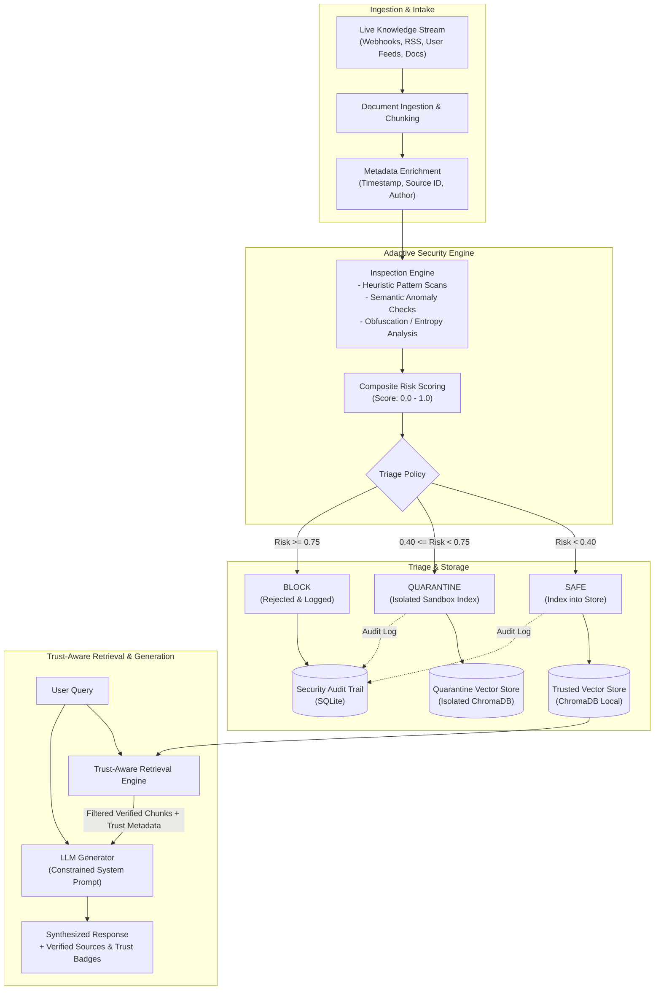

# AdaptiveShield RAG: System Architecture

## 1. Architectural Overview

AdaptiveShield RAG introduces a preemptive, stream-oriented security layer between dynamic data feeds and vector indexing stores. Traditional RAG security predominantly applies guardrails post-retrieval (inspecting user queries and synthesized responses). In contrast, AdaptiveShield evaluates documents **at the ingestion boundary**, ensuring that tainted, adversarial, or out-of-distribution chunks are quarantined or blocked prior to contaminating the trusted vector database.

---

## 2. End-to-End Pipeline Diagram

---

## 3. Component Deep Dive

### 3.1. Ingestion Layer
- **Live Knowledge Stream:** Asynchronous event listener or polling consumer capable of handling incoming documents, batch updates, or continuous message streams.
- **Normalization & Chunking:**
  - Standardizes text encoding (UTF-8) and strips deceptive zero-width unicode characters.
  - Chunks text into bounded token windows (e.g., 256–512 tokens with overlap) to preserve contextual coherence while isolating injected payloads to discrete chunks.
- **Provenance Enrichment:** Attaches immutable metadata to each chunk, including source URI, ingestion timestamp, content hash (SHA-256), and ingest batch ID.

### 3.2. Security Engine & Risk Scoring
The Security Engine applies a defense-in-depth, multi-signal inspection pipeline on each incoming chunk before vectorization:

1. **Heuristic & Signature Matching:**
   - Detects canonical indirect prompt injection markers (e.g., `"ignore previous instructions"`, `"system override"`, `"assistant mode disabled"`, markdown exploit tags).
   - Identifies covert control tokens and special prompt delimiter impersonation.
2. **Structural & Entropy Analysis:**
   - Evaluates Shannon entropy and character-to-token ratios to detect base64, hex, or character-substitution obfuscation.
   - Detects hidden text patterns (e.g., repetitive whitespace padding, zero-width joiners).
3. **Semantic Anomaly Detection:**
   - Uses local embedding representations (`Sentence Transformers`) to measure semantic distance against baseline corpus centroids.
   - Flags sudden semantic drift or context hijacking patterns where content abruptly shifts topic towards instruction execution.
4. **Composite Risk Formulation:**
   - Produces a normalized risk score \( R \in [0.0, 1.0] \) computed as a weighted combination of heuristic score, structural anomaly score, and semantic distance score.

### 3.3. Triage & Storage Management
Based on configured thresholds in `.env` (`RISK_THRESHOLD_QUARANTINE`, `RISK_THRESHOLD_BLOCK`), chunks are triaged:

- **SAFE (\( R < 0.40 \)):**
  - Chunk is indexed into the **Trusted Vector Store** (ChromaDB) with metadata tag `status: safe` and recorded in the SQLite audit database.
- **QUARANTINE (\( 0.40 \le R < 0.75 \)):**
  - Chunk is diverted away from production search and stored in an isolated **Quarantine Index**.
  - Accessible only via an administrative/analyst interface for deeper inspection, automated sandbox evaluation, or secondary verification.
- **BLOCK (\( R \ge 0.75 \)):**
  - Payload is immediately discarded from all vector indices.
  - Detailed attack telemetry (payload hash, matched heuristics, threat severity) is committed to the **SQLite Audit Trail** for incident response.

### 3.4. Trust-Aware Retrieval & LLM Generation
- **Trust-Aware Retrieval:**
  - Queries are executed exclusively against the **Trusted Vector Store**.
  - Retrieval filtering enforces strict metadata predicates (`status == 'safe'`).
  - Search ranking takes both vector similarity (cosine score) and chunk trust confidence into account.
- **LLM Grounding & Response Generation:**
  - Retrieved chunks are injected into the prompt wrapped with clear structural delimiters and provenance identifiers.
  - The system prompt instructs the model to adhere strictly to cited facts and refuse instructions embedded inside source contexts.
  - The final output presents the synthesized answer along with granular source citations and verified trust ratings.

---

## 4. Key Design Decisions & Trade-Offs

| Decision | Alternative Considered | Selected Approach | Rationale |
| :--- | :--- | :--- | :--- |
| **Ingestion-Time Filtering** | Post-retrieval filtering only | Ingestion-time triage + Post-retrieval verification | Prevents persistent vector store poisoning and eliminates the risk of poisoned chunks occupying top-k slots during retrieval. |
| **Local Vector Database** | Managed cloud service (Pinecone, Weaviate Cloud) | ChromaDB (local embedded) | Zero external dependencies for local development and reproducibility in prototype/hackathon phase. |
| **Local Embedding Model** | Commercial API (OpenAI text-embedding-3) | Sentence Transformers (`all-MiniLM-L6-v2`) | Low latency, no API cost, completely offline verification of embedding generation and clustering. |
| **Relational Metadata Store** | PostgreSQL | SQLite | Embedded, zero-configuration file database suitable for prototyping; seamless migration to PostgreSQL if needed. |

---

## 5. Security & Isolation Boundaries

1. **Vector Store Boundary:** Quarantined and blocked chunks are cryptographically and logically segregated from the trusted index to prevent accidental retrieval leakage.
2. **Execution Boundary:** Ingested documents are treated as untrusted data and parsed in a memory-safe environment without dynamic evaluation or execution.
3. **Context Injection Boundary:** Retrieved context provided to the downstream LLM uses strict schema formatting (XML/JSON encapsulation) to prevent prompt boundary escaping.
