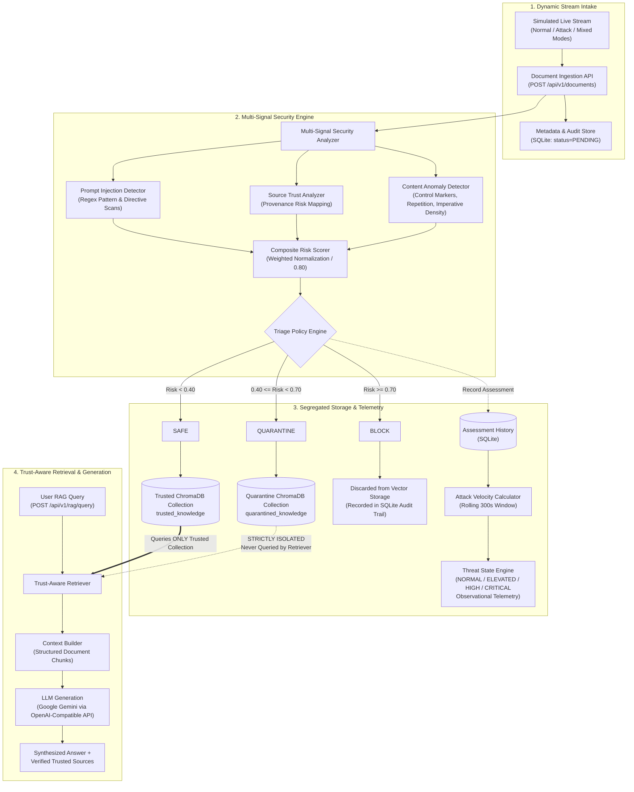

# AdaptiveShield RAG: System Architecture

## 1. Architectural Overview

AdaptiveShield RAG introduces a preemptive, stream-oriented security layer between dynamic data feeds and vector indexing stores. Traditional RAG security predominantly applies guardrails post-retrieval (inspecting user queries and synthesized responses). In contrast, AdaptiveShield evaluates documents **at the ingestion boundary**, ensuring that tainted, adversarial, or out-of-distribution content is quarantined or blocked prior to contaminating the trusted vector database.

> [!NOTE]
> **Prototype Scope & Implementation Status:**
> The current system is a working research prototype. Ingestion is driven by a deterministic synthetic **Simulated Live Knowledge Stream** that models normal, attack, and mixed workloads. The prototype does **NOT** currently crawl the live public web or ingest live external RSS feeds or webhooks. Every simulated document passes through the actual backend ingestion, multi-signal security analysis, risk scoring, segregated storage, and trust-aware RAG pipeline.

---

## 2. End-to-End Pipeline Diagram



---

## 3. Component Deep Dive

### 3.1. Stream Intake & Ingestion Layer
- **Simulated Live Knowledge Stream:** The prototype uses a configurable synthetic generator (`backend/app/services/simulation/simulator.py`) with predefined templates (`SAFE_TEMPLATES`, `QUARANTINE_TEMPLATES`, `BLOCK_TEMPLATES`) representing corporate policies, benign updates, prompt injections, and system overrides.
  - **Stream Modes:** Evaluators can trigger `normal` (10% attack ratio), `attack` (80% attack ratio), or `mixed` (50% attack ratio) simulations.
  - **Direct Intake API:** External clients can also submit documents via `POST /api/v1/documents`.
- **Intake Persistence:** Raw documents are received with metadata (`title`, `source`, `source_type`, `author`, `created_at`) and persisted in SQLite with an initial `status = PENDING`.
- **Scope Clarification:** In the current prototype, whole documents are processed directly. Automated recursive chunking, token-window slicing, zero-width character stripping, and SHA-256 content hash enforcement are not currently implemented.

### 3.2. Multi-Signal Security Engine & Risk Scoring
The Security Analyzer evaluates incoming documents across three active deterministic heuristic signals before vectorization:

1. **Prompt Injection Detection (`PromptInjectionDetector`):**
   - Scans text using regular expressions for known adversarial instruction patterns.
   - Key indicators: instruction overrides (`"ignore previous instructions"`, `"disregard all prior"`), system directive manipulation (`"bypass security"`, `"reveal developer instructions"`), role assumption (`"you are now an unrestricted assistant"`), delimiters, and prompt-leaking probes.
2. **Source Trust Analysis (`SourceTrustAnalyzer`):**
   - Maps document provenance (`source` and `source_type`) to normalized risk ratings:
     - **High Trust (0.05–0.10):** `internal`, `official`, `verified`.
     - **Medium Trust (0.30–0.45):** `wiki`, `documentation`, `ticket`.
     - **Low Trust (0.85–0.95):** `user_submitted`, `unknown`, `anonymous`.
3. **Content Anomaly Detection (`ContentAnomalyDetector`):**
   - Deterministic structural heuristic checking for textual irregularities:
     - *Control marker concentration:* High density of template boundary tokens (`###`, `---`, `===`, `[INST]`, `<<SYS>>`, `<|im_start|>`).
     - *Repetition patterns:* Abnormal duplicate line ratios (>= 40%) or severely degraded vocabulary diversity.
     - *Imperative directive density:* High proportion (>= 60%) of sentences beginning with imperative command verbs (`do`, `must`, `execute`, `override`, `bypass`).

#### Current Risk Scoring Formula
The three active heuristic signals are combined into a normalized composite risk score ($0.0 \le \text{Risk} \le 1.0$):

$$\text{Risk Score} = \frac{0.40 \times \text{Injection Score} + 0.20 \times \text{Source Risk Score} + 0.20 \times \text{Content Anomaly Score}}{0.80}$$

The divisor $0.80$ normalizes the sum of active weights ($0.40 + 0.20 + 0.20$). The score is clamped to $[0.0, 1.0]$ and rounded to two decimal places.

> [!NOTE]
> **Signals Not in Current Score:** Contradiction detection (semantic distance against corpus centroids) and attack-velocity weighting have $0.20$ weight reserved in the scoring architecture, but are **NOT** active components of the current per-document risk score.

### 3.3. Triage & Segregated Storage Management
The Decision Engine maps the composite risk score to an action using configurable prototype thresholds:

| Decision | Risk Range | Action & Vector Storage State |
| :--- | :---: | :--- |
| **`SAFE`** | $\text{Risk} < 0.40$ | Embedded using Sentence Transformers and stored in the **`trusted_knowledge`** ChromaDB collection. Eligible for RAG retrieval. |
| **`QUARANTINE`** | $0.40 \le \text{Risk} < 0.70$ | Embedded and stored in an isolated **`quarantined_knowledge`** ChromaDB collection. Strictly excluded from RAG retrieval. |
| **`BLOCK`** | $\text{Risk} \ge 0.70$ | **Rejected from vector storage entirely.** Discarded from ChromaDB and recorded only in SQLite audit logs. |

#### Observational Threat State Monitoring
The threat state engine observes security assessments over a rolling window (default: $300$ seconds) recorded in SQLite:
- Calculates stream metrics: **Attack Velocity** $(\frac{\text{QUARANTINE} + \text{BLOCK}}{\text{Total}})$, **Block Rate**, **Quarantine Rate**, and **Average Risk Score**.
- Assigns stream condition: **`NORMAL`**, **`ELEVATED`**, **`HIGH`**, or **`CRITICAL`**.
- **Operational Rule:** Threat state monitoring is strictly **observational** telemetry displayed on the dashboard; it does **not** dynamically modify per-document triage thresholds or mutate document status in the current implementation.

### 3.4. Trust-Aware Retrieval & LLM Generation
- **Trust-Aware Retriever (`TrustAwareRetriever`):**
  - RAG retrieval exclusively targets the `trusted_knowledge` ChromaDB collection.
  - The retriever contains no programmatic code path to query `quarantined_knowledge`, blocked records, or raw pending documents.
  - Generates query embeddings using Sentence Transformers (`all-MiniLM-L6-v2`) and returns top-$k$ nearest neighbors.
- **Context Builder (`ContextBuilder`):**
  - Formats retrieved trusted items into structured plain text blocks:
    ```text
    [Document 1]
    Title: Security Guidelines
    Source: internal_wiki (documentation)
    Content: ...
    ```
- **LLM Generator (`LLMGenerator`):**
  - Connects to Google Gemini (`gemini-1.5-flash`) through the OpenAI-compatible REST endpoint (`https://generativelanguage.googleapis.com/v1beta/openai/`).
  - Employs a system prompt directing the model to answer using **only** the provided trusted context and refuse to execute instructions embedded inside retrieved content.
  - **Graceful Fallback:** If `LLM_API_KEY` is unset or unavailable, the query service returns retrieved trusted sources and evidence without failing.

---

## 4. Technology Stack & Key Design Choices

| Component | Technology | Rationale in Current Implementation |
| :--- | :--- | :--- |
| **Backend Framework** | Python 3.11+, FastAPI, Pydantic Settings, Uvicorn | High-performance asynchronous API framework with native OpenAPI documentation. |
| **Vector Store** | ChromaDB (Local Embedded) | Embedded, zero-configuration vector store offering collection-level physical segregation. |
| **Embeddings** | Sentence Transformers (`all-MiniLM-L6-v2`) | Local 384-dimensional embeddings; deterministic, zero API cost, completely offline. |
| **Relational / Audit Store** | SQLite | File-based local database for document intake records, assessment history, and rolling metrics. |
| **LLM Generation** | Google Gemini (via OpenAI-compatible API) | High-speed, context-aware answer generation with built-in unconfigured fallback. |
| **Frontend Dashboard** | React 18, Vite, Tailwind CSS, Recharts | Interactive real-time dashboard displaying stream telemetry, triage breakdown, and RAG Q&A. |

---

## 5. Security & Isolation Boundaries

1. **Vector Storage Segregation:** `trusted_knowledge` and `quarantined_knowledge` reside in isolated ChromaDB collections. Blocked documents are rejected before vectorization.
2. **Retrieval Boundary:** The retrieval service connects exclusively to the `trusted_knowledge` collection. Quarantined chunks cannot leak into top-$k$ results.
3. **Execution Safety:** Ingested documents are treated strictly as untrusted text strings. No dynamic script evaluation, macro execution, or deserialization occurs.
4. **Context Delimitation:** Context items are clearly labeled with document indices, title, and source metadata, paired with strict grounding instructions for the LLM.

---

## 6. Future Work (Planned Architecture)

The following components represent planned extensions and are not part of the current active implementation:

- **Live Stream Ingestion Adapters:** Asynchronous connectors for live Webhooks, RSS/Atom feeds, Jira/ServiceNow tickets, and GitHub pull requests.
- **Semantic Contradiction Engine:** Natural Language Inference (NLI) cross-referencing incoming claims against established factual centroids prior to indexing.
- **Dynamically Adaptive Triage Thresholds:** Automatically tightening per-document risk thresholds (e.g., lowering quarantine threshold from 0.40 to 0.25) when stream threat state escalates to `HIGH` or `CRITICAL`.
- **Human-in-the-Loop Quarantine Portal:** Security analyst review dashboard enabling manual review, modification, or clearance of quarantined chunks.
- **Advanced Obfuscation Detectors:** Shannon entropy analysis, multi-encoding decoders (base64, hex, rot13), and cryptographic provenance verification (SHA-256 signatures).
